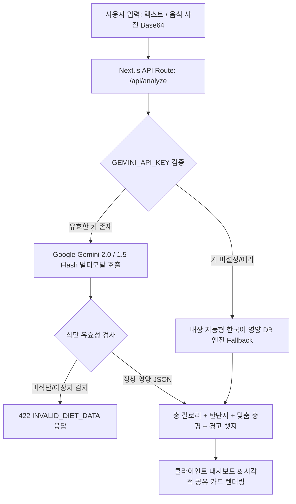

# [AI 고도화 개발 계획서] NutriSnap Gemini AI 멀티모달 서비스 개선 계획

> **문서 버전**: v1.0.0  
> **기준 문서**: [PRD.md](../PRD.md), [DEVELOPMENT_PLAN.md](./DEVELOPMENT_PLAN.md)  
> **생성 일시**: 2026-08-27  
> **목표**: 실제 Google Gemini 멀티모달 API를 기반으로 초정밀 식단 분석, 이미지 인식 필터링 및 지능형 영양 코칭 서비스 구축  

---

## 1. AI 서비스 현황 진단

### 1.1 현재 파이프라인 강점
* **하이브리드 아키텍처**: Gemini API 호출 실패나 네트워크 지연 시, 내장된 한국어 영양 DB Fallback 엔진이 작동하여 100% 가용성 보장.
* **구조화 JSON 스키마**: 총 칼로리, 탄단지(g), 1줄 총평, 과다/부족 경고 뱃지, 음식별 분해 데이터 강제 반환.
* **5종 예외 시나리오 방어**: 1초 자동 재시도, 로딩 오버레이, 비정상 데이터 에러 UI 등 완비.

### 1.2 개선 필요 사항 및 고도화 기회
1. **공식 SDK (`@google/genai` / `@google/generative-ai`) 도입**:
   - 원시 `fetch` 호출 대신 공식 클라이언트를 도입하여 에러 핸들링, 스트리밍, 타임아웃 관리 고도화.
2. **최신 모델 업그레이드 (`gemini-2.0-flash`, `gemini-1.5-flash`)**:
   - 복합 한국어 식단(예: 국/찌개류, 반찬 여러 가지, 배달음식)에 대한 텍스트/사진 시각 추론 정확도 향상.
3. **비식단(Non-Food) 이미지 지능형 탐지**:
   - 음식 사진이 아닌 풍경, 인물, 영수증 등이 업로드되었을 때 이를 감지하여 PRD 5.5 규격에 맞는 재점검 에러 반환.
4. **목표 맞춤형 초개인화 AI 코칭**:
   - 사용자의 신체 정보(BMR/TDEE)와 선택한 목적(다이어트: -500kcal, 벌크업: +400kcal)을 프롬프트 시스템 지침에 정밀 주입하여 영양사 수준의 조언 생성.

---

## 2. 세부 AI 고도화 개발 계획



### 2.1 [Phase 1] SDK 설치 및 멀티모달 API 호출 엔진 업그레이드
* `@google/genai` 공식 SDK 설치
* `app/api/analyze/route.ts`에 최신 Gemini Flash 클라이언트 인스턴스 구축
* System Instruction과 Structured Outputs (`responseSchema` / `responseMimeType: "application/json"`) 적용

### 2.2 [Phase 2] 프롬프트 엔지니어링 정밀화
* **시스템 역할**: 임상영양사 및 스포츠 영양 코치 페르소나 부여
* **한국 식단 특화 영양 DB 지침 주입**: 밥 공기 단위, 찌개 염분/국물 칼로리, 고기류 1인분 g 기준 정밀화
* **비식단 필터링**: `isFood: boolean` 필드를 스키마에 추가하여 음식이 아닐 경우 즉각 감지

### 2.3 [Phase 3] 지능형 영양 분석 응답 스키마
```json
{
  "isFood": true,
  "totalCalories": 580,
  "carbs": 65,
  "protein": 34,
  "fat": 18,
  "summaryComment": "체중 감량에 매우 이상적인 고단백 식단입니다!",
  "warnings": [
    "💡 단백질 섭취량이 목표치에 아주 적합합니다.",
    "⚠️ 나트륨 함량이 다소 높을 수 있으니 국물 섭취에 유의하세요."
  ],
  "items": [
    { "name": "닭가슴살 샐러드", "calories": 220, "carbs": 8, "protein": 28, "fat": 4 },
    { "name": "현미밥 1공기", "calories": 280, "carbs": 58, "protein": 7, "fat": 2 },
    { "name": "된장국", "calories": 80, "carbs": 8, "protein": 4, "fat": 2 }
  ]
}
```

---

## 3. 실행 로드맵 및 일정

| 단계 | 개발 태스크 | 산출물 | 상태 |
| :---: | :--- | :--- | :---: |
| **Step 1** | API 키 환경변수 바인딩 및 SDK 의존성 추가 | `package.json`, `.env.local` | 🟡 진행 중 |
| **Step 2** | `app/api/analyze/route.ts` Gemini 2.0/1.5 멀티모달 파이프라인 고도화 | `app/api/analyze/route.ts` | ⬜ 대기 |
| **Step 3** | 비식단 이미지/텍스트 예외 탐지 및 에러 핸들링 연동 | `lib/ai-client.ts` | ⬜ 대기 |
| **Step 4** | E2E 실제 AI 호출 테스트 및 무결성 검증 | 터미널 및 로컬 브라우저 | ⬜ 대기 |
