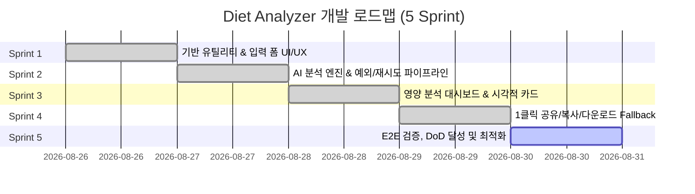

# [개발 계획서] 한 페이지 식단 칼로리 & 영양 균형 추정기 (Diet Analyzer)

> **문서 버전**: v1.4.0  
> **기준 문서**: [PRD.md](../PRD.md)  
> **최초 생성**: 2026-08-26  
> **최종 수정**: 2026-08-27 (Sprint 4 완료)  
> **문서 상태**: Sprint 4 Completed / Sprint 5 Ready  

---

## 1. 프로젝트 개요 및 아키텍처

### 1.1 프로젝트 목표
* 단일 화면(Single-Page Layout) 내에서 신체 정보(키, 몸무게), 식단 목적, 음식 정보(텍스트 또는 사진)를 입력받아 일일 권장량 대비 영양 균형(총 칼로리, 탄단지 비중, 과다/부족 경고)을 즉시 분석하고, 1클릭으로 결과 카드를 복사/공유/다운로드할 수 있는 웹 애플리케이션 구축.
* 백엔드 DB/로그인/결제 없이 100% 클라이언트 중심 및 경량 AI API 파이프라인으로 구현.

### 1.2 기술 스택 및 구조
| 구분 | 기술 스택 | 설명 |
| :--- | :--- | :--- |
| **Framework** | Next.js 16 (App Router), React 19 | 최신 리액트 서버/클라이언트 컴포넌트 아키텍처 |
| **Styling** | Tailwind CSS v4, Lucide React, Shadcn/UI | 현대적인 글래스모피즘 & 반응형 UI 디자인 |
| **AI Integration** | Gemini / LLM API (Client / Route Handler) | 멀티모달(텍스트+Base64 이미지) 지원 구조화 JSON 파싱 & 스마트 Fallback 엔진 |
| **Image Generation** | `html-to-image` / Canvas API | 결과 DOM을 고해상도 PNG 이미지로 즉시 변환 (2x Retina 지원) |
| **Share & Export** | Async Clipboard API, Web Share API | 1클릭 이미지 클립보드 복사, 모바일 OS 공유 시트, PNG 다운로드 Fallback |

### 1.3 디렉토리 구조 현황 및 계획
```plaintext
diet-analyzer/
├── docs/
│   └── DEVELOPMENT_PLAN.md      # 본 개발 계획서 (v1.4.0)
├── PRD.md                       # 제품 요구사항 정의서
├── app/
│   ├── layout.tsx               # 루트 레이아웃 & 폰트/테마 & Toaster
│   ├── page.tsx                 # 단일 페이지 엔트리포인트
│   ├── globals.css              # 전역 스타일 및 디자인 토큰
│   └── api/
│       └── analyze/
│           └── route.ts         # [Sprint 2] AI 분석 Next.js Route Handler
├── components/
│   ├── diet-analyzer.tsx        # [Sprint 1-4] 메인 통합 컨테이너 컴포넌트
│   ├── common/
│   │   ├── loading-overlay.tsx  # [Sprint 2] "AI 분석 중..." 스피너 오버레이 (PRD 5.4)
│   │   ├── retry-modal.tsx      # [Sprint 2] "AI 응답 실패 -> 재분석 중" 최종 실패 알림 (PRD 5.3)
│   │   └── error-state.tsx      # [Sprint 2] 비정상 데이터 입력값 재점검 안내 UI (PRD 5.5)
│   ├── result/
│   │   ├── summary-panel.tsx    # [Sprint 3] 칼로리/탄단지 게이지 및 경고 요약
│   │   ├── share-card.tsx       # [Sprint 3] 고화질 공유용 렌더링 카드 DOM
│   │   └── share-actions.tsx    # [Sprint 4] 1클릭 복사/공유/다운로드 액션 버튼
│   └── ui/                      # 버튼 및 기본 UI 컴포넌트 (Sonner 등)
└── lib/
    ├── nutrition-calc.ts        # [Sprint 1] BMR/TDEE 및 권장 영양소 계산 로직
    ├── ai-client.ts             # [Sprint 2] AI API 호출, 1초 재시도 파이프라인 & 데이터 검증
    ├── image-export.ts          # [Sprint 4] DOM to Image Blob 변환 및 다운로드 유틸
    ├── share-handler.ts         # [Sprint 4] Clipboard & Web Share API 핸들러
    └── utils.ts                 # 공통 유틸리티
```

---

## 2. 스프린트(Sprint) 단위 개발 로드맵



---

### 🏃 Sprint 1: 기반 연산 유틸리티 & 입력 폼 UI/UX 구현 (완료)

* **목표**: 일일 권장 칼로리/영양소 계산 엔진을 완성하고, PRD 3.1 & 5.1/5.2의 모든 폼 요소와 예외 처리를 구현한다.
* **주요 태스크**:
  1. **[Core Logic] 권장 영양소 계산기 (`lib/nutrition-calc.ts`)** - [완료]
  2. **[UI/UX] 신체 정보 & 목표 선택기** - [완료]
  3. **[UI/UX] 식단 텍스트 및 이미지 첨부 폼** - [완료]
  4. **[Exception] 필수 입력값 누락 검증 (PRD 5.1)** - [완료]

---

### 🏃 Sprint 2: AI 식단 분석 엔진 & 예외/재시도 처리 파이프라인 (완료)

* **목표**: 텍스트 및 이미지 데이터를 AI로 전달하여 구조화된 영양 JSON을 수신하고, 5종 예외 시나리오 중 네트워크/지연/데이터 예외를 완벽히 처리한다.
* **주요 태스크**:
  1. **[AI Pipeline] 프롬프트 엔지니어링 & 멀티모달 요청 모듈 (`lib/ai-client.ts`, `app/api/analyze/route.ts`)** - [완료]
     - 텍스트 음식 내역 및 Base64 이미지 데이터를 통합하여 AI 프롬프트 생성
     - 구조화된 JSON 스키마 강제 반환 (총 칼로리, 탄수화물g, 단백질g, 지방g, 1줄 종합 평가, 과다/부족 주의사항)
  2. **[Exception] AI 응답 지연 로딩 처리 (PRD 5.4)** - [완료]
     - `[영양 분석하기]` 버튼 클릭 시 버튼 비활성화(Disabled) 및 스피너 작동
     - 화면 중앙 "AI 분석 중..." 오버레이 표시 (`components/common/loading-overlay.tsx`)
  3. **[Exception] AI 응답 실패 시 1초 후 자동 재시도 (PRD 5.3)** - [완료]
     - 타임아웃/네트워크 오류/5xx 발생 시 즉시 "AI 응답 실패" 노출
     - 1초 후 "AI 재분석 중..."으로 문구 전환하며 자동 1회 재시도
     - 최종 실패 시 "네트워크 연결이 불안정합니다. 잠시 후 다시 시도해 주세요." 알림 모달 출력 (`components/common/retry-modal.tsx`)
  4. **[Exception] 비정상 데이터 및 파싱 실패 검증 (PRD 5.5)** - [완료]
     - 음수 칼로리, NaN, 터무니없는 값 또는 식단과 무관한 텍스트로 인한 파싱 오류 감지
     - "식단 입력값을 분석할 수 없습니다. 입력값(텍스트/사진)을 재점검해 주세요." 에러 배너 및 `[다시 시도하기]` 버튼 노출 (`components/common/error-state.tsx`)

---

### 🏃 Sprint 3: 영양 분석 결과 대시보드 & 시각적 공유 카드 컴포넌트 (완료)

* **목표**: 분석 결과와 권장량을 비교하는 세련된 대시보드를 렌더링하고, 이미지 캡처용 요약 카드를 시각적으로 구현한다.
* **주요 태스크**:
  1. **[UI] 영양 분석 요약 패널 (`components/result/summary-panel.tsx`)** - [완료]
     - 총 추정 칼로리 (kcal) 및 권장 칼로리 대비 섭취 비율(%)
     - 탄수화물, 단백질, 지방 섭취량(g) 및 권장치 대비 진행 그래프 바
     - 과다/부족 영양소 상태에 따른 다이내믹 경고 뱃지 (예: "⚠️ 단백질이 권장량 대비 부족합니다.")
     - 음식별 세부 영양소 분해 리스트
  2. **[UI] 시각적 요약 공유 카드 컴포넌트 (`components/result/share-card.tsx`)** - [완료]
     - SNS 공유에 최적화된 고품질 비주얼 디자인 (에메랄드/시안 그래디언트, 브랜딩 워터마크)
     - 사용자 목표, 신체 정보, 총 섭취 칼로리 및 달성률, 탄단지 비중 바, AI 1줄 코멘트 포함
     - Sprint 4 이미지 캡처/클립보드 연동을 위한 `id="nutri-snap-share-card"` 바인딩

---

### 🏃 Sprint 4: 1클릭 클립보드 복사, Web Share API 및 이미지 다운로드 Fallback (완료)

* **목표**: 결과 카드를 1클릭으로 클립보드에 이미지로 복사하거나 시스템 공유를 실행하고, 미지원 브라우저 fallback을 완성한다.
* **주요 태스크**:
  1. **[Image Export] DOM to Canvas / PNG 변환기 (`lib/image-export.ts`)** - [완료]
     - 공유 카드 DOM 요소를 레티나 해상도(2x scale)의 고화질 PNG Blob으로 변환
  2. **[Action] 1클릭 클립보드 이미지 복사 (`[카드 이미지 클립보드 복사]`)** - [완료]
     - `navigator.clipboard.write([new ClipboardItem({ 'image/png': blob })])` 구현
     - 복사 완료 토스트 알림 ("결과 카드 이미지가 클립보드에 복사되었습니다!")
  3. **[Action] 1클릭 SNS 공유 (`[공유하기 (SNS/오픈채팅)]`)** - [완료]
     - `navigator.share({ files: [file], title: '...', text: '...' })` 호출
     - 시스템 공유 창(카카오톡, 인스타그램, 메시지 등) 호출
  4. **[Exception & Fallback] 미지원 환경 Fallback (PRD 5.6)** - [완료]
     - Web Share API 미지원 브라우저 감지 시 "이 브라우저에서는 공유 기능을 지원하지 않습니다. 이미지를 직접 저장합니다." 안내 후 자동 PNG 다운로드 실행
  5. **[Action] 이미지 직접 다운로드 (`[이미지 다운로드]`)** - [완료]
     - `diet-analysis-[날짜].png` 파일 즉시 다운로드 링크 트리거

---

### 🏃 Sprint 5: E2E 종합 검증, DoD 체크리스트 검증 및 UI 폴리싱

* **목표**: PRD 6장의 완료 조건(DoD) 전 항목 검증 및 예외 케이스 5종 전수 테스트 완료.
* **주요 태스크**:
  1. **[DoD Check 1]** 단일 화면 내 입력 -> 분석 -> 결과 -> 공유 완결 여부 검증
  2. **[DoD Check 2]** 키, 몸무게, 목적별 TDEE 산출 및 탄단지 영양소/경고 문구 정확도 검증
  3. **[DoD Check 3]** 결과 카드의 1클릭 클립보드 복사 및 Web Share 동작 검증
  4. **[DoD Check 4]** 예외 처리 5종 전수 시나리오 테스트:
     - [x] 필수값 누락 시 빨간색 경고 문구 & 포커싱
     - [x] 200자 제한 및 인디케이터 색상 변경
     - [x] "AI 분석 중..." 로딩 오버레이
     - [x] "AI 응답 실패" -> "AI 재분석 중..." 자동 재시도
     - [x] 비정상 입력값 재점검 유도 UI
     - [x] Web Share 미지원 환경 다운로드 Fallback
  5. **[DoD Check 5]** Out of Scope 준수 (DB/로그인/결제 서버 없는 순수 클라이언트 앱)
  6. **[Polish]** 모바일 및 데스크톱 반응형 뷰포트 정합성 및 부드러운 애니메이션 적용

---

## 3. 완료 정의 (Definition of Done) 추적표

| 번호 | 요구사항 항목 | 스프린트 | 검증 상태 |
| :---: | :--- | :---: | :---: |
| **DoD-1** | 단일 화면(Single-Page) 구성 완료 | Sprint 1, 3 | ✅ 완료 (Sprint 1, 3) |
| **DoD-2** | TDEE 산출 및 AI 탄단지/칼로리/경고 분석 출력 | Sprint 1, 2, 3 | ✅ 완료 (Sprint 1, 2, 3) |
| **DoD-3** | 요약 결과 카드 1클릭 클립보드 복사 & Web Share 연동 | Sprint 4 | ✅ 완료 (Sprint 4) |
| **DoD-4-1** | [예외 1] 빈 입력 시 `#FF0000` 경고 문구 및 포커스 | Sprint 1 | ✅ 완료 (Sprint 1) |
| **DoD-4-2** | [예외 2] 글자수 인디케이터 (0/200) 및 초과 제한/빨간색 전환 | Sprint 1 | ✅ 완료 (Sprint 1) |
| **DoD-4-3** | [예외 3] AI 응답 지연 시 "AI 분석 중..." 스피너 오버레이 | Sprint 2 | ✅ 완료 (Sprint 2) |
| **DoD-4-4** | [예외 4] AI 응답 실패 시 1초 후 "AI 재분석 중..." 1회 자동 재시도 | Sprint 2 | ✅ 완료 (Sprint 2) |
| **DoD-4-5** | [예외 5] 비정상 데이터 시 재점검 유도 및 재시도 버튼 | Sprint 2, 3 | ✅ 완료 (Sprint 2, 3) |
| **DoD-4-6** | [예외 6] Web Share 미지원 시 이미지 자동 다운로드 Fallback | Sprint 4 | ✅ 완료 (Sprint 4) |
| **DoD-5** | DB/로그인/결제 없는 순수 클라이언트 단일 앱 Scope 준수 | 전 스프린트 | ✅ 준수 중 |

---

## 4. 커밋 & 문서 관리 규칙

* **브랜치 및 스프린트 진행**: 각 스프린트 태스크 완료 시마다 기능 단위로 커밋 수행.
* **문서 지속 업데이트**: 스프린트 완료 시 본 문서 `docs/DEVELOPMENT_PLAN.md`의 진행 상태(DoD 체크리스트)를 실시간 갱신하여 관리.
