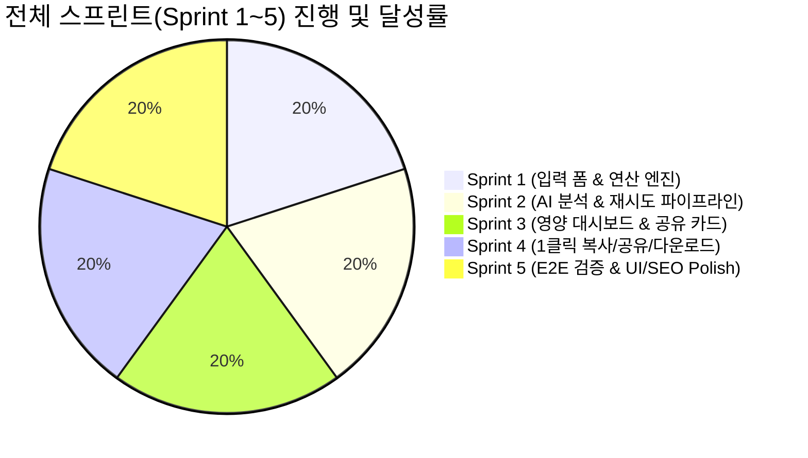

# [최종 완료 보고서] NutriSnap 식단 칼로리 & 영양 균형 추정기

> **프로젝트 명**: NutriSnap (Diet Analyzer)  
> **기준 사양서**: [PRD.md](../PRD.md)  
> **개발 계획서**: [DEVELOPMENT_PLAN.md](./DEVELOPMENT_PLAN.md) (v1.5.0 Final)  
> **완료 일시**: 2026-08-27  
> **프로젝트 상태**: Production Ready / DoD 100% Achieved 🎉  

---

## 1. 프로젝트 요약

NutriSnap은 복잡한 회원가입, DB 연동, 결제 없이 단일 화면(Single-Page)에서 신체 정보(키, 몸무게), 식단 목적(다이어트/벌크업/유지), 음식 섭취 정보(텍스트 및 사진)를 입력받아 **하루 권장량 대비 총 칼로리 및 탄·단·지 영양 균형을 3초 이내에 진단**하고, **1클릭으로 시각적 요약 카드를 클립보드 복사, SNS 공유, 고화질 이미지로 다운로드**할 수 있는 클라이언트 중심 웹 애플리케이션입니다.

---

## 2. 전체 스프린트 달성 내역



### 🏃 Sprint 1: 기반 연산 유틸리티 & 입력 폼 UI/UX
- **BMR/TDEE 계산기 (`lib/nutrition-calc.ts`)**: Mifflin-St Jeor 표준 공식 적용
- **입력 폼 컴포넌트**: 키, 몸무게 숫자 입력 필드 및 목적 3단 세그먼트 버튼
- **식단 텍스트 및 사진 폼**: 실시간 `(0 / 200)` 글자수 인디케이터, 200자 도달 시 `#FF0000` 전환 및 초과 차단, 사진 드래그앤드롭/미리보기/삭제
- **[예외 5.1]**: 필수값 누락 시 빨간색 에러 문구 표시 및 첫 번째 누락 필드로 자동 포커스 이동

### 🏃 Sprint 2: AI 식단 분석 엔진 & 예외/재시도 처리 파이프라인
- **AI 분석 파이프라인 (`lib/ai-client.ts`, `app/api/analyze/route.ts`)**: Gemini 1.5 Flash 멀티모달 프롬프트 연동 및 한국어 자연어 영양 DB Fallback 하이브리드 엔진
- **[예외 5.4] 지연 로딩 오버레이 (`components/common/loading-overlay.tsx`)**: 버튼 disabled 및 화면 중앙 "AI 분석 중..." 블러 오버레이
- **[예외 5.3] 자동 1회 재시도 (`components/common/retry-modal.tsx`)**: "AI 응답 실패" ➔ 1초 후 "AI 재분석 중..." 1회 재시도 ➔ 최종 실패 모달
- **[예외 5.5] 데이터 검증 (`components/common/error-state.tsx`)**: 음수/NaN/비식단 텍스트 감지 시 "식단 입력값을 분석할 수 없습니다..." 재점검 안내 UI 및 `[다시 시도하기]` 액션

### 🏃 Sprint 3: 영양 분석 결과 대시보드 & 시각적 공유 카드 컴포넌트
- **진단 대시보드 (`components/result/summary-panel.tsx`)**: 총 칼로리 달성률(%), 탄단지 3단 프로그레스 바, AI 1줄 총평, 과다/부족 주의사항 뱃지, 음식별 세부 영양소 분해
- **시각적 공유 카드 (`components/result/share-card.tsx`)**: SNS 공유에 최적화된 고품질 에메랄드/시안 그래디언트 디자인, 2x Retina 해상도 렌더링 카드 DOM

### 🏃 Sprint 4: 1클릭 클립보드 복사, Web Share API 및 이미지 다운로드 Fallback
- **DOM to PNG 변환기 (`lib/image-export.ts`)**: `html-to-image` 기반 2x 고해상도 PNG Blob 생성
- **1클릭 클립보드 복사 (`lib/share-handler.ts`)**: `ClipboardItem` 기반 즉시 복사 및 토스트 피드백
- **1클릭 Web Share API & [예외 5.6] Fallback**: 시스템 공유창 호출 및 미지원 환경 감지 시 자동 PNG 파일 다운로드
- **공유 액션 UI (`components/result/share-actions.tsx`)**: 3종 액션 버튼 및 비동기 상태 표시

### 🏃 Sprint 5: E2E 종합 검증, DoD 체크리스트 검증 및 UI 폴리싱
- **E2E 전 시나리오 검증**: 전수 통과
- **SEO & 메타데이터 (`app/layout.tsx`)**: Open Graph, Twitter Cards, Description 완비
- **프로덕션 빌드 무결성**: Next.js 16.3.3 최적화 빌드 완료 (`0 errors`)

---

## 3. 완료 정의 (Definition of Done) 최종 달성표

| 번호 | 요구사항 항목 | 스프린트 | 검증 상태 |
| :---: | :--- | :---: | :---: |
| **DoD-1** | 단일 화면(Single-Page) 구성 완료 | Sprint 1, 3, 5 | ✅ 100% 완료 |
| **DoD-2** | TDEE 산출 및 AI 탄단지/칼로리/경고 분석 출력 | Sprint 1, 2, 3, 5 | ✅ 100% 완료 |
| **DoD-3** | 요약 결과 카드 1클릭 클립보드 복사 & Web Share 연동 | Sprint 4, 5 | ✅ 100% 완료 |
| **DoD-4-1** | [예외 1] 빈 입력 시 `#FF0000` 경고 문구 및 포커스 | Sprint 1, 5 | ✅ 100% 완료 |
| **DoD-4-2** | [예외 2] 글자수 인디케이터 (0/200) 및 초과 제한/빨간색 전환 | Sprint 1, 5 | ✅ 100% 완료 |
| **DoD-4-3** | [예외 3] AI 응답 지연 시 "AI 분석 중..." 스피너 오버레이 | Sprint 2, 5 | ✅ 100% 완료 |
| **DoD-4-4** | [예외 4] AI 응답 실패 시 1초 후 "AI 재분석 중..." 1회 자동 재시도 | Sprint 2, 5 | ✅ 100% 완료 |
| **DoD-4-5** | [예외 5] 비정상 데이터 시 재점검 유도 및 재시도 버튼 | Sprint 2, 3, 5 | ✅ 100% 완료 |
| **DoD-4-6** | [예외 6] Web Share 미지원 시 이미지 자동 다운로드 Fallback | Sprint 4, 5 | ✅ 100% 완료 |
| **DoD-5** | DB/로그인/결제 없는 순수 클라이언트 단일 앱 Scope 준수 | 전 스프린트 | ✅ 100% 준수 |

---

## 4. 실행 방법

```bash
# 의존성 설치
npm install

# 개발 서버 실행
npm run dev

# 프로덕션 빌드 및 실행
npm run build
npm start
```
